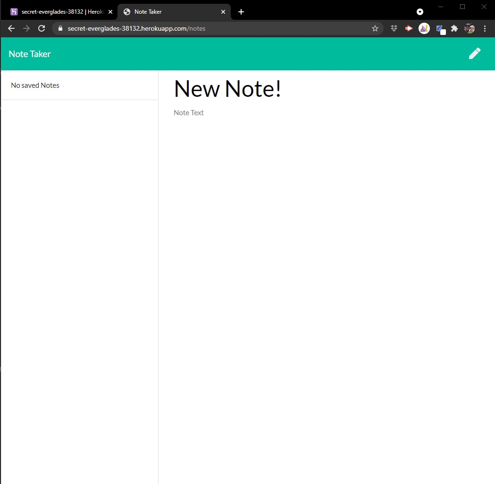

# Note Taker App

[]

App to allow users to create a list of notes.

## Table of Contents

- [Installation](#Installation)
- [Usage](#Usage)
- [License](#License)
- [Contributing](#Contributing)
- [Tests](#Tests)
- [Questions](#Questions)

## Installation

Please follow these steps to ensure a proper installation.
If opening locally, run the following command "npm run start", otherwise you can see a live version running at the following Heroku URL "https://secret-everglades-38132.herokuapp.com/"

## Usage

The following will outline the steps needed to use this project.  
You will enter a title and a note on the right side. Then, when you press save, you will be able to see a list of notes started on the left side. Click on the note, and you will see the contents.

## License

The MIT License

Please follow the link to learn more about the License this project is protected under.
[https://opensource.org/licenses/MIT](https://opensource.org/licenses/MIT)

## Contributing

How can you contribute?
Please send me any questions or comments you may have.

## Tests

The following test steps can be taken to ensure the project is running correctly.
When running locally, use the terminal command "npm run watch" this will use nodemon to run the application.

## Questions

Please contact me with any questions about this project.

Production App [Note Taker](https://secret-everglades-38132.herokuapp.com/)

My GitHub URL is [https://github.com/jmalm79](https://github.com/jmalm79)

Email: jmalm79@gmail.com

